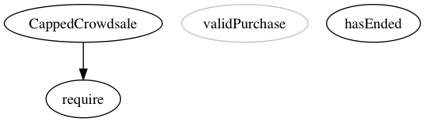
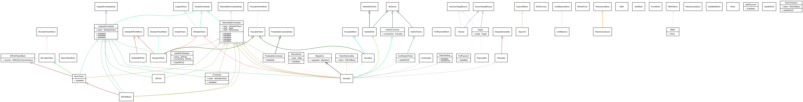
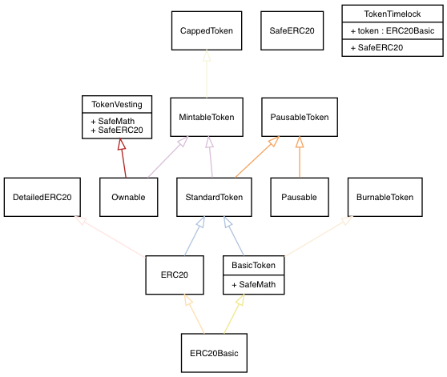

# Ethereum Contract Development Toolbox

Various tools used for Solidity smart-contract development.

-----

The following features are available using MakeFile

## Make Merged

Combines contract imports into a single Solidity file using [sol-merger](https://www.npmjs.com/package/sol-merger)

**Example Usage:**
**`make merged dir="crowdsale" contract="CappedCrowdsale"`**

- ./contracts/**dir**/**contract**
- **dir** = subdirectory within contracts directory (optional)
- **contract** = contract name to be flattened

**output** file saved to ./build/merged/**contract**/

```sh
$(shell pwd -P)/node_modules/.bin/sol-merger $(shell pwd -P)/contracts/$(dir)/$(contract).sol $(shell pwd -P)/build/merged/$(contract)
```

-----

## Make Mergeall

The same as **Make Merged** except it is recursive for the selected directory.

**Example Usage:**
**`make mergeall dir="tokens"`**

- ./contracts/**dir**/
- **dir** = subdirectory within contracts directory (optional)

**output** file saved to ./build/merged/

```sh
	$(shell pwd -P)/node_modules/sol-merger/bin/sol-merger.js "$(shell pwd -P)/contracts/$(dir)/*.sol" build/merged/$(dir)
```

-----

### Make Solgraph

Graph Single Contract as .PNG using Solgraph

**Example Usage:**
**`make graphpng dir="crowdsale" contract="CappedCrowdsale"`**

- ./contracts/**dir**/**contract**
- **dir** = subdirectory within contracts directory (optional)
- **contract** = contract name to create Solgraph

**output** file saved to ./build/solgraphs/**contract**/

```sh
	$(shell pwd -P)/node_modules/.bin/solgraph $(shell pwd -P)/contracts/$(dir)/$(contract).sol | dot -Tpng > $(shell pwd -P)/build/temp/$(contract).png
	cp $(shell pwd -P)/build/temp/$(contract).png $(shell pwd -P)/build/solgraphs/$(contract).png
	rm $(shell pwd -P)/build/temp/$(contract).png
```



-----

### make graphrec

**Example Usage - All Contracts**
`make graphrec`

**Example Usage - Contracts Subdirectory**
`make graphrec directory="Token"'

*directory* = ./contracts/*directory*/
output file location in ./build/solgraphs/*contract*.png


Contracts Directory Recursive Overview



-----

make treemap


-----
make treespec


-----
make compile


**WIP**

##Useful Commands

compile
`solc --optimize --abi --bin --metadata contract.sol`

solgraph clipboard to preview (OSX)
`pbpaste | solgraph | dot -Tpng | open -f -a /Applications/Preview.app`